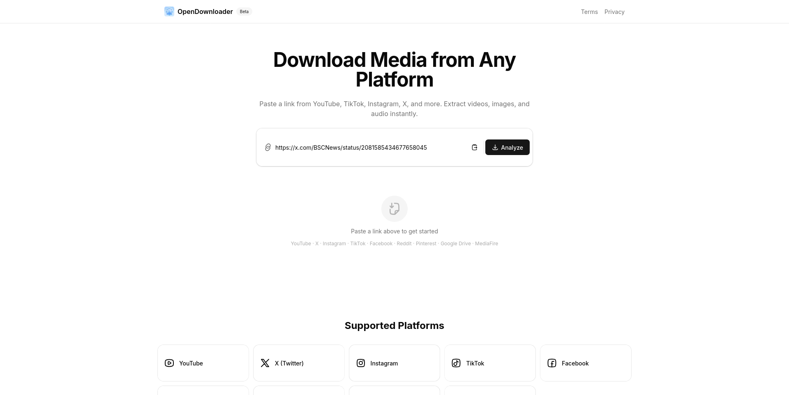

# OpenDownloader – Free Online Media Downloader



**OpenDownloader** is a free, open-source media downloader that lets you download videos, images, and audio from YouTube, X (Twitter), Instagram, TikTok, Facebook, Pinterest, Reddit, Google Drive, and MediaFire. No sign-up required. No ads. No tracking.

## Features

- **Multi-Platform Support** — Download from YouTube, X/Twitter, Instagram, TikTok, Facebook, Pinterest, Reddit, Google Drive, and MediaFire
- **Video Downloader** — Download high-quality HD videos from any supported platform
- **Audio Extraction** — Extract and download audio/mp3 from YouTube and other video platforms
- **Image Downloader** — Download high-resolution images from Instagram, Pinterest, and more
- **MediaFire Downloader** — Direct file downloads from MediaFire without captcha
- **Google Drive Downloader** — Download files from Google Drive shared links
- **Proxy Download** — Automatic proxy routing for CORS-protected CDNs (video.twimg.com, ssl.cf, cdn.discord)
- **Refresh-Proof** — Results persist in localStorage so you don't lose them on page refresh
- **Dark Mode** — Built-in dark mode support
- **Responsive Design** — Works on desktop and mobile
- **SEO Optimized** — Proper metadata, Open Graph tags, and Twitter cards for social sharing

## Supported Platforms

| Platform | URLs | Media Types |
|----------|------|-------------|
| YouTube | `youtube.com`, `youtu.be`, `m.youtube.com` | Video, Audio (mp3/mp4) |
| X / Twitter | `x.com`, `twitter.com` | Video (HD/SD) |
| Instagram | `instagram.com`, `instagr.am` | Images, Videos |
| TikTok | `tiktok.com`, `vm.tiktok.com` | Video, Audio |
| Facebook | `facebook.com`, `fb.watch`, `fb.com` | Video (Normal/HD) |
| Pinterest | `pinterest.com`, `pin.it`, `pin.it` | Images |
| Reddit | `reddit.com`, `redd.it` | Video, Images |
| Google Drive | `drive.google.com` | Files |
| MediaFire | `mediafire.com` | Files |

## How to Use

1. **Paste a URL** — Copy any supported media URL and paste it into the input field
2. **Click Analyze** — The tool detects the platform and extracts available media
3. **Download** — Choose individual files or click "Download All" for bulk download

## Tech Stack

- **Framework:** Next.js 16 (App Router)
- **UI:** shadcn/ui, Tailwind CSS v4
- **Icons:** Hugeicons
- **Download Engine:** btch-downloader
- **URL Parser:** social-link-parser + custom regex fallbacks
- **Storage:** localStorage (client-side persistence)
- **Deployment:** Vercel

## Live Demo

Try it now: [https://open-downloader-snowy.vercel.app/](https://open-downloader-snowy.vercel.app/)

## Development

```bash
git clone https://github.com/prasangapokharel/OpenDownloader.git
cd OpenDownloader
npm install
npm run dev
```

The development server starts at `http://localhost:3000`.

### Build

```bash
npm run build
```

### Lint & Typecheck

```bash
npm run lint
npm run typecheck
```

## Why OpenDownloader?

- **Free online video downloader** — no subscription, no hidden fees
- **Private** — we don't store your downloads or personal data
- **Fast** — direct anchor download, no buffering through our servers
- **Open source** — fully transparent codebase, contributions welcome

## License

MIT
